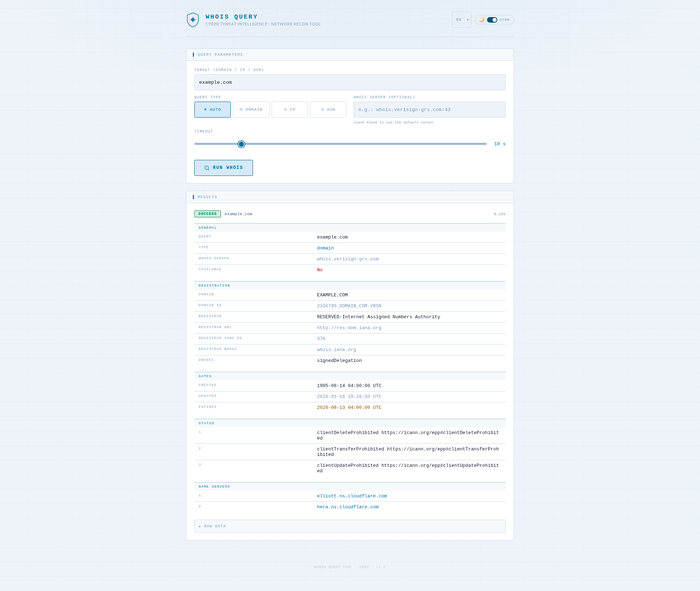

# http2whois

> **WHOIS-over-HTTP** — A lightweight, stateless HTTP gateway that exposes WHOIS queries as a JSON REST API.

Built in Go, it accepts a `POST` request with a target (domain, IP address or ASN) and returns the parsed WHOIS record as structured JSON. The binary embeds a static web UI and an OpenAPI specification, with zero runtime dependencies.

---

## Screenshot



> The embedded web UI (served at `/`) provides an interactive form to issue WHOIS queries and inspect responses directly in the browser. It supports **dark and light themes** and is fully translated into **15 languages**.

---

## Disclaimer

This project is released **as-is**, for demonstration or reference purposes.
It is **not maintained**: no bug fixes, dependency updates, or new features are planned. Issues and pull requests will not be addressed.

---

## License

This project is licensed under the **MIT License** — see the [`LICENSE`](LICENSE) file for details.

```
MIT License — Copyright (c) 2026 letstool
```

---

## Features

- Single static binary — no external runtime dependencies
- Embedded web UI and OpenAPI 3.0 specification (`/openapi.json`)
- Web UI available in **dark and light mode**, switchable at runtime via a toggle
- Web UI fully translated into **15 languages**: Arabic, Bengali, Chinese, German, English, Spanish, French, Hindi, Indonesian, Japanese, Korean, Portuguese, Russian, Urdu, Vietnamese
- Supports **domain names**, **IPv4 / IPv6 addresses**, and **AS numbers**
- Automatic **referral chain** following — queries are forwarded to the most authoritative WHOIS server
- Covers **1 000+ TLDs**: all ccTLDs, legacy gTLDs, new gTLDs, and IDN TLDs
- Returns fully **structured and parsed** WHOIS data (registrar, dates, name servers, contacts, network ranges, …)
- Raw WHOIS responses included alongside parsed fields
- Configurable listen address, WHOIS socket timeout, and HTTP request deadline
- Optional per-request custom WHOIS server and timeout override
- Docker image built on `scratch` — minimal attack surface

---

## Build

### Prerequisites

- [Go](https://go.dev/dl/) **1.24+**

### Native binary (Linux)

```bash
bash scripts/linux_build.sh
```

The binary is output to `./out/http2whois`.

The script produces a **fully static binary** (no libc dependency):

```bash
go build \
    -trimpath \
    -ldflags="-extldflags -static -s -w" \
    -tags netgo \
    -o ./out/http2whois ./cmd/http2whois
```

### Windows

```cmd
scripts\windows_build.cmd
```

### Docker image

```bash
bash scripts/docker_build.sh
```

This runs a two-stage Docker build:

1. **Builder** — `golang:1.24-alpine` compiles a static binary
2. **Runtime** — `scratch` image, containing only the binary

The resulting image is tagged `letstool/http2whois:latest`.

---

## Run

### Native (Linux)

```bash
bash scripts/linux_run.sh
```

This sets `LISTEN_ADDR=0.0.0.0:8080` and runs the binary.

### Windows

```cmd
scripts\windows_run.cmd
```

### Docker

```bash
bash scripts/docker_run.sh
```

Equivalent to:

```bash
docker run -it --rm -p 8080:8080 -e LISTEN_ADDR=0.0.0.0:8080 letstool/http2whois:latest
```

Once running, the service is available at [http://localhost:8080/](http://localhost:8080/).

---

## Configuration

Each setting can be provided as a CLI flag or an environment variable. The CLI flag always takes priority. Resolution order: **CLI flag → environment variable → default**.

| CLI flag            | Environment variable | Default           | Description                                                              |
|---------------------|----------------------|-------------------|--------------------------------------------------------------------------|
| `-addr`             | `LISTEN_ADDR`        | `127.0.0.1:8080`  | Address and port the HTTP server listens on.                             |
| `-whois-timeout`    | `WHOIS_TIMEOUT`      | `15s`             | Per-query WHOIS socket timeout. Accepts Go duration strings (e.g. `30s`). |
| `-request-timeout`  | `REQUEST_TIMEOUT`    | `20s`             | Global HTTP request deadline, including all referral hops.               |

**Examples:**

```bash
# Using CLI flags
./out/http2whois -addr 0.0.0.0:9090 -whois-timeout 30s -request-timeout 45s

# Using environment variables
LISTEN_ADDR=0.0.0.0:9090 WHOIS_TIMEOUT=30s REQUEST_TIMEOUT=45s ./out/http2whois

# Mixed: CLI flag overrides the environment variable for addr only
LISTEN_ADDR=0.0.0.0:9090 ./out/http2whois -addr 127.0.0.1:8080
```

---

## API Reference

### `POST /api/v1/whois`

Performs a WHOIS lookup and returns parsed structured data.

Exactly one of `ip`, `domain`, or `asn` must be provided per request.

#### Request body

```json
{
  "domain": "example.com",
  "whoisserver": "whois.verisign-grs.com:43",
  "timeout": 10
}
```

| Field         | Type      | Required | Description                                                                                   |
|---------------|-----------|----------|-----------------------------------------------------------------------------------------------|
| `ip`          | `string`  | ❌       | IPv4 or IPv6 address to look up (e.g. `8.8.8.8`, `2001:4860:4860::8888`)                     |
| `domain`      | `string`  | ❌       | Domain name to look up (e.g. `example.com`)                                                   |
| `asn`         | `string`  | ❌       | Autonomous System Number, with or without the `AS` prefix (e.g. `15169` or `AS15169`)        |
| `whoisserver` | `string`  | ❌       | Custom WHOIS server (`host` or `host:port`). Applies to domain lookups only.                 |
| `timeout`     | `integer` | ❌       | Per-request WHOIS timeout in seconds (`0` uses the server default).                           |

#### Response body

```json
{
  "status": "SUCCESS",
  "answers": {
    "query": "example.com",
    "queryType": "domain",
    "whoisServer": "whois.verisign-grs.com",
    "domainName": "EXAMPLE.COM",
    "registrar": "RESERVED-Internet Assigned Numbers Authority",
    "registrarURL": "http://res-dom.iana.org",
    "nameServers": ["a.iana-servers.net", "b.iana-servers.net"],
    "status": ["clientDeleteProhibited https://icann.org/epp#clientDeleteProhibited"],
    "created": "1995-08-14T04:00:00Z",
    "updated": "2026-01-16T18:26:50Z",
    "expires": "2026-08-13T04:00:00Z",
    "available": false,
    "rawData": ["..."]
  }
}
```

| Field     | Type                    | Description                                                  |
|-----------|-------------------------|--------------------------------------------------------------|
| `status`  | `string`                | `SUCCESS`, `NOTFOUND`, or `ERROR`                            |
| `answers` | `WhoisResult \| string` | Parsed WHOIS result on success, or an error message string.  |

**`WhoisResult` object:**

| Field                  | Type        | Description                                               |
|------------------------|-------------|-----------------------------------------------------------|
| `query`                | `string`    | The original query value                                  |
| `queryType`            | `string`    | `domain`, `ipv4`, `ipv6`, or `asn`                        |
| `whoisServer`          | `string`    | First WHOIS server contacted                              |
| `available`            | `boolean`   | `true` if the domain is not registered                    |
| `domainName`           | `string`    | Registered domain name                                    |
| `registrar`            | `string`    | Registrar name                                            |
| `registrarURL`         | `string`    | Registrar website                                         |
| `registrarIANAID`      | `string`    | Registrar IANA ID                                         |
| `registrarWhoisServer` | `string`    | Registrar's own WHOIS server                              |
| `registrarAbuseEmail`  | `string`    | Registrar abuse contact email                             |
| `registrarAbusePhone`  | `string`    | Registrar abuse contact phone                             |
| `nameServers`          | `string[]`  | List of authoritative name servers                        |
| `status`               | `string[]`  | EPP status codes                                          |
| `dnssec`               | `string`    | DNSSEC status                                             |
| `created`              | `date-time` | Registration date                                         |
| `updated`              | `date-time` | Last update date                                          |
| `expires`              | `date-time` | Expiry date                                               |
| `registrant`           | `Contact`   | Registrant contact                                        |
| `admin`                | `Contact`   | Administrative contact                                    |
| `tech`                 | `Contact`   | Technical contact                                         |
| `network`              | `string`    | IP network range (IP lookups)                             |
| `netName`              | `string`    | Network name (IP lookups)                                 |
| `origin`               | `string`    | Originating ASN (IP lookups)                              |
| `asName`               | `string`    | AS name (ASN lookups)                                     |
| `routes`               | `string[]`  | Announced routes (ASN lookups)                            |
| `rawData`              | `string[]`  | Raw WHOIS text from each server in the referral chain     |

Each `Contact` object:

| Field          | Type     | Description              |
|----------------|----------|--------------------------|
| `name`         | `string` | Full name                |
| `organization` | `string` | Organization             |
| `email`        | `string` | Email address            |
| `phone`        | `string` | Phone number             |
| `fax`          | `string` | Fax number               |
| `street`       | `string` | Street address           |
| `city`         | `string` | City                     |
| `state`        | `string` | State or province        |
| `postalCode`   | `string` | Postal code              |
| `country`      | `string` | Country code             |

#### Status codes

| Value      | Meaning                                                        |
|------------|----------------------------------------------------------------|
| `SUCCESS`  | Query succeeded, `answers` contains the parsed WHOIS result   |
| `NOTFOUND` | No WHOIS record found for the target                          |
| `ERROR`    | Query failed (bad request, network error, or invalid input)   |

#### Examples

**Resolve a domain name:**

```bash
curl -s -X POST http://localhost:8080/api/v1/whois \
  -H "Content-Type: application/json" \
  -d '{"domain":"example.com"}' | jq .
```

```json
{
  "status": "SUCCESS",
  "answers": {
    "query": "example.com",
    "queryType": "domain",
    "whoisServer": "whois.verisign-grs.com",
    "domainName": "EXAMPLE.COM",
    "registrar": "RESERVED-Internet Assigned Numbers Authority",
    "nameServers": ["a.iana-servers.net", "b.iana-servers.net"],
    "created": "1995-08-14T04:00:00Z",
    "expires": "2026-08-13T04:00:00Z",
    "available": false
  }
}
```

**Look up an IP address:**

```bash
curl -s -X POST http://localhost:8080/api/v1/whois \
  -H "Content-Type: application/json" \
  -d '{"ip":"8.8.8.8"}' | jq .
```

```json
{
  "status": "SUCCESS",
  "answers": {
    "query": "8.8.8.8",
    "queryType": "ipv4",
    "whoisServer": "whois.arin.net",
    "network": "8.8.8.0 - 8.8.8.255",
    "netName": "GOGL",
    "origin": "AS15169",
    "available": false
  }
}
```

**Look up an AS number:**

```bash
curl -s -X POST http://localhost:8080/api/v1/whois \
  -H "Content-Type: application/json" \
  -d '{"asn":"AS15169"}' | jq .
```

```json
{
  "status": "SUCCESS",
  "answers": {
    "query": "AS15169",
    "queryType": "asn",
    "whoisServer": "whois.arin.net",
    "asName": "GOOGLE",
    "available": false
  }
}
```

---

### `GET /`

Returns the embedded interactive web UI.

### `GET /openapi.json`

Returns the full OpenAPI 3.0 specification of the API.

### `GET /favicon.png`

Returns the application icon.

---

## Development

Dependencies are managed with Go modules. After cloning:

```bash
go mod download
go build ./...
```

A standalone CLI tool is also available for quick tests without the HTTP server:

```bash
go run ./cmd/whois example.com
go run ./cmd/whois 8.8.8.8
go run ./cmd/whois AS15169
```

The test suite and initialization scripts are located in `scripts/`:

```
scripts/000_init.sh     # Environment setup
scripts/999_test.sh     # Integration tests
```

---

## Credits

The embedded WHOIS client (`internal/whoisclient`) is an adaptation of **[prowebcraft/whois-parser](https://github.com/prowebcraft/whois-parser)**, automatically ported and restructured by **[Claude Sonnet 4.6](https://www.anthropic.com/claude)** by Anthropic.

---

## AI-Assisted Development

This project was developed with the assistance of **[Claude Sonnet 4.6](https://www.anthropic.com/claude)** by Anthropic.
